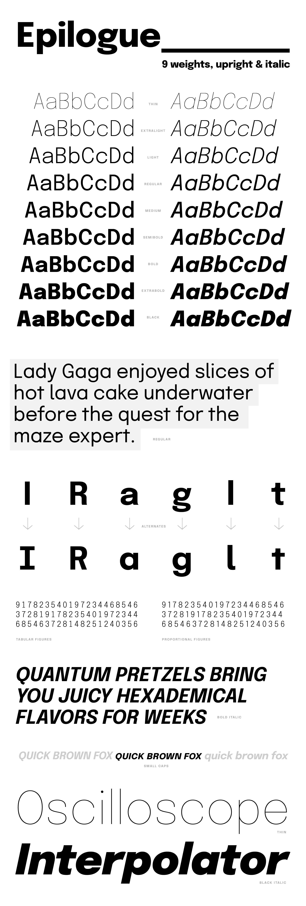

# Epilogue
## 2 axes / Variable / 9 Weights / Italics / Sans

 

 Currently at the [Latin Plus](https://github.com/googlefonts/gftools/tree/master/Lib/gftools/encodings/GF%20Glyph%20Sets) character set.

 Suppports the following languages:
 **Abenaki, Afaan Oromo, Afar, Afrikaans, Albanian, Alsatian, Amis, Anuta, Aragonese, Aranese, Aromanian, Arrernte, Arvanitic (Latin), Asturian, Atayal, Aymara, Azerbaijani, Bashkir (Latin), Basque, Belarusian (Latin), Bemba, Bikol, Bislama, Bosnian, Breton, Cape Verdean Creole, Catalan, Cebuano, Chamorro, Chavacano, Chichewa, Chickasaw, Cimbrian, Cofán, Cornish, Corsican, Creek, Crimean Tatar (Latin), Croatian, Czech, Danish, Dawan, Delaware, Dholuo, Drehu, Dutch, English, Esperanto, Estonian, Faroese, Fijian, Filipino, Finnish, Folkspraak, French, Frisian, Friulian, Gagauz (Latin), Galician, Ganda, Genoese, German, Gikuyu, Gooniyandi, Greenlandic (Kalaallisut), Guadeloupean Creole, Gwich’in, Haitian Creole, Hän, Hawaiian, Hiligaynon, Hopi, Hotcąk (Latin), Hungarian, Icelandic, Ido, Igbo, Ilocano, Indonesian, Interglossa, Interlingua, Irish, Istro-Romanian, Italian, Jamaican, Javanese (Latin), Jèrriais, Kaingang, Kala Lagaw Ya, Kapampangan (Latin), Kaqchikel, Karakalpak (Latin), Karelian (Latin), Kashubian, Kikongo, Kinyarwanda, Kiribati, Kirundi, Klingon, Kurdish (Latin), Ladin, Latin, Latino sine Flexione, Latvian, Lithuanian, Lojban, Lombard, Low Saxon, Luxembourgish, Maasai, Makhuwa, Malay, Maltese, Manx, Māori, Marquesan, Megleno-Romanian, Meriam Mir, Mirandese, Mohawk, Moldovan, Montagnais, Montenegrin, Murrinh-Patha, Nagamese Creole, Nahuatl, Ndebele, Neapolitan, Ngiyambaa, Niuean, Noongar, Norwegian, Novial, Occidental, Occitan, Old Icelandic, Old Norse, Onĕipŏt, Oshiwambo, Ossetian (Latin), Palauan, Papiamento, Piedmontese, Polish, Portuguese, Potawatomi, Q’eqchi’, Quechua, Rarotongan, Romanian, Romansh, Rotokas, Sami (Inari Sami), Sami (Lule Sami), Sami (Northern Sami), Sami (Southern Sami), Samoan, Sango, Saramaccan, Sardinian, Scottish Gaelic, Serbian (Latin), Seri, Seychellois Creole, Shawnee, Shona, Sicilian, Silesian, Slovak, Slovenian, Slovio (Latin), Somali, Sorbian (Lower Sorbian), Sorbian (Upper Sorbian), Sotho (Northern), Sotho (Southern), Spanish, Sranan, Sundanese (Latin), Swahili, Swazi, Swedish, Tagalog, Tahitian, Tetum, Tok Pisin, Tokelauan, Tongan, Tshiluba, Tsonga, Tswana, Tumbuka, Turkish, Turkmen (Latin), Tuvaluan, Tzotzil, Uzbek (Latin), Venetian, Vepsian, Volapük, Võro, Wallisian, Walloon, Waray-Waray, Warlpiri, Wayuu, Welsh, Wik-Mungkan, Wiradjuri, Wolof, Xavante, Xhosa, Yapese, Yindjibarndi, Zapotec, Zarma, Zazaki, Zulu, Zuni**

## Building

Fonts are built automatically by GitHub Actions - take a look in the "Actions" tab for the latest build.

If you particularly want to build fonts manually on your own computer, you will need to install the [`yq` utility](https://github.com/mikefarah/yq). On OS X with Homebrew, type `brew install yq`; on Linux, try `snap install yq`; if all else fails, try the instructions on the linked page.

Then:

* `make build` will produce font files.
* `make test` will run [FontBakery](https://github.com/googlefonts/fontbakery)'s quality assurance tests.
* `make proof` will generate HTML proof files.

## License

This Font Software is licensed under the SIL Open Font License, Version 1.1.
This license is copied below, and is also available with a FAQ at
http://scripts.sil.org/OFL

## Repository Layout

This font repository structure is inspired by [Unified Font Repository v0.3](https://github.com/unified-font-repository/Unified-Font-Repository), modified for the Google Fonts workflow.
